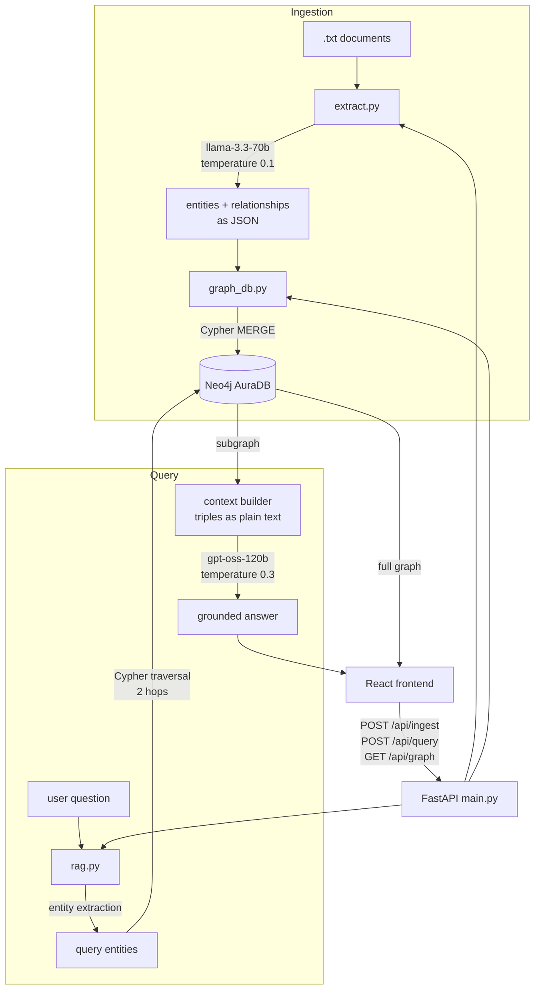
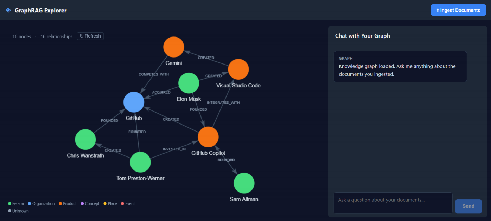

# Graph RAG

Retrieval over a knowledge graph instead of a vector index. Documents are read once by an LLM that extracts entities and relationships, those become nodes and edges in Neo4j, and a question is answered by traversing the graph around the entities it mentions.

The point of the pattern is the kind of question it answers. Vector search finds passages that resemble the question. A graph answers questions about how things connect, which no amount of similarity will surface if the connection was never stated in a single passage.

## Architecture




The graph built from the sample documents, seen in Neo4j:



The frontend renders the same data, so an answer can be checked against the subgraph it came from rather than taken on trust.

## Design Q&A

### Why MERGE and never CREATE?

Ingestion has to be safe to run twice. `MERGE` matches an existing node or creates it if absent, so re-running the pipeline over the same documents converges on the same graph instead of duplicating every entity. Entities are also deduplicated by lowercased name during extraction, so the same organization mentioned in three documents becomes one node with three sets of edges rather than three disconnected copies.

### Why are relationship types built by string interpolation, and is that safe?

Cypher does not accept a parameter in the position of a relationship type. The type has to be part of the query string, which means the one value coming from the LLM that cannot be parameterised is exactly the one that ends up in the query text.

The mitigation is a whitelist by construction rather than a blacklist: the relation name is filtered down to alphanumeric characters and underscores, and anything that reduces to an empty string falls back to `RELATED_TO`. Everything else in the query, including both entity names, is passed as a bound parameter.

### Why is graph context given to the model as plain text triples?

The subgraph is available as JSON, and passing JSON is the obvious choice. Formatting it as readable triples, `OpenAI --CREATED--> GPT-4`, produced noticeably better answers in practice. The model spends less effort parsing structure and more on the relationships themselves.

### Why two hops?

Two hops covers the questions the pattern exists for, entity to neighbour to neighbour, without pulling in the whole graph. Traversal depth is a cost and latency decision as much as a relevance one: every extra hop widens the subgraph geometrically and the context has to carry all of it.

### Why two different models?

Extraction runs on `llama-3.3-70b` at temperature 0.1, because it is closer to parsing than to writing and the same document should yield the same graph. Answering runs on `gpt-oss-120b` at 0.3, where some variation makes the prose readable. Temperature is a per-task decision, not a global setting.

### How is hallucination handled?

The answering prompt constrains the model to the supplied graph context, requires it to say when the context is insufficient, and asks it to cite which relationships support the answer. Grounding is easier to enforce here than in vector RAG, because the context is a small set of explicit facts rather than prose passages that may or may not contain the answer.

## Known trade-offs

**Extraction quality is the ceiling.** If the LLM misses an entity or a relationship while reading, no query can recover it later. Vector RAG degrades gracefully when retrieval is imperfect; graph RAG simply does not have the fact.

**There is no semantic matching on the query side.** The question has to name an entity that exists in the graph. A synonym, an abbreviation or a misspelling finds nothing, where a vector index would still return something close.

**Entity resolution is exact-name only.** "OpenAI" and "Open AI" become two separate nodes. Proper resolution needs fuzzy matching or an alias table.

**Documents are truncated at 4000 characters** during extraction to keep each call focused. Longer sources need chunking with entity merging across chunks.

**Traversal depth is fixed at two hops.** It is not adapted to the question, so some queries retrieve more context than they need and others less.

**This project does not measure graph against vector.** It demonstrates the pattern and documents where it breaks down, but the comparison that would show when a graph earns its extra ingestion cost is not in here. That is the natural next step.

## Run it

Requires a Neo4j AuraDB instance and a Groq API key.

```bash
uv sync
cp .env.example .env   # NEO4J_URI, NEO4J_USERNAME, NEO4J_PASSWORD, GROQ_API_KEY
```

```bash
uv run uvicorn main:app --reload
```

```bash
cd frontend && npm install && npm run dev
```

Drop `.txt` files into `documents/` and call `POST /api/ingest` to build the graph, then ask questions through the UI or `POST /api/query`.

## Stack

Python 3.13 · FastAPI · Neo4j AuraDB · Groq · React · Vite · uv
