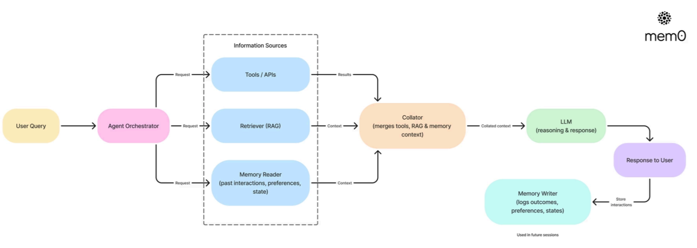

# Persistent Memory Agent

A chat agent that remembers you across sessions. Built with **mem0**, Groq, local HuggingFace embeddings and Qdrant on disk.

Close the terminal, come back tomorrow, use the same name, and the agent still knows you are vegetarian and that you are learning Portuguese.

## Why This Project Matters

Most chat implementations confuse two different things and call both "memory":

- **Session context** is the conversation you are having right now. It is verbatim, it lives in the request, and it disappears when the process ends.
- **Long-term memory** is what survives. It is not the transcript — it is the *facts* extracted from it, stored and retrieved by meaning.

This project implements both layers explicitly, because they have different costs and different failure modes.

## How a Turn Works

```
user input
   → search long-term memory for relevant facts   (semantic search on Qdrant)
   → inject those facts into the system prompt
   → call the LLM with prompt + session history
   → reply to the user
   → extract facts from the turn and store them   (background thread)
```

The read happens *before* the reply. The write happens *after*, off the critical path.

## Architecture



| Component | Choice | Why |
|---|---|---|
| Memory layer | mem0 | Handles fact extraction, deduplication and retrieval |
| LLM | Groq (`llama-3.3-70b-versatile`) | Fast and free tier |
| Embeddings | HuggingFace `multi-qa-MiniLM-L6-cos-v1`, local | Runs on device, no API cost per embedding |
| Vector store | Qdrant, on local disk | Persists between runs without a server |

The whole stack runs for free and requires only a Groq API key.

Memories are scoped by `user_id`. Same id across sessions means persistent memory; a different id means a fresh memory space.

## Design Q&A

### Why keep two layers of memory instead of one?

Because they answer different questions. Session history keeps the conversation coherent right now — pronouns, follow-ups, "what did I just say". Long-term memory answers "what do I know about this person", and that has to survive the session.

Storing full transcripts forever would be the naive version: cost grows every turn and the context window eventually overflows. Storing extracted *facts* keeps the payload small and retrievable by meaning.

### Why is the memory write in a background thread?

Saving a turn is not one operation. mem0 calls the LLM to extract facts, then again to deduplicate against what is already stored, and only then writes to Qdrant. Doing that inline means the user stares at a frozen prompt after every reply.

The write is not on the critical path of the answer, so it does not belong in it. The reply returns immediately and saving happens concurrently.

**The trade-off:** it is a daemon thread, so quitting immediately after a reply can drop that turn's memory. For a lab this is acceptable. In production this would be a proper queue with retry, which is exactly the reason queues exist.

### Why two different temperatures?

Fact extraction runs at `0.1` and conversation at `0.7`. Extraction is closer to parsing than to writing — the same input should produce the same facts. Replies are prose, where some variation is what makes it readable.

Temperature is a per-task decision, not a global setting.

### Why local embeddings instead of an embedding API?

Every stored memory and every search is an embedding call. On an API that is a recurring cost that grows with usage. The model here is ~90MB, downloads once, and runs on device.

### Why do the embedding dimensions appear twice in the config?

`embedding_dims: 384` in the embedder and `embedding_model_dims: 384` in the vector store must match, because Qdrant creates the collection with a fixed vector size. Mismatch fails at insert time, not at startup, which makes it an annoying bug to trace. It is duplicated in the config on purpose, so the coupling is visible.

## Run

```bash
uv sync
cp .env.example .env   # add your GROQ_API_KEY
```

```bash
# macOS / Linux
PYTHONPATH=. uv run python src/main.py
```

```powershell
# Windows PowerShell
$env:PYTHONPATH="."; uv run python src/main.py
```

First run downloads the embedding model (~90MB).

Inside the chat: type `memories` to see everything stored about you, `quit` to exit.

## Known Trade-offs

- **Background writes can be lost** on immediate exit (see Design Q&A).
- **`list_memories` searches with an empty query** rather than using a dedicated listing call — it works, but it is a retrieval call doing an enumeration job.
- **The Qdrant path is POSIX-style** (`/tmp/qdrant`) and resolves oddly on Windows. Should come from an environment variable.
- **No memory expiry.** Facts accumulate and are never revised or forgotten, so a stale fact stays forever.
